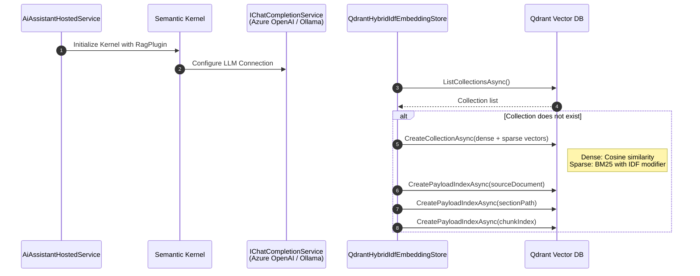
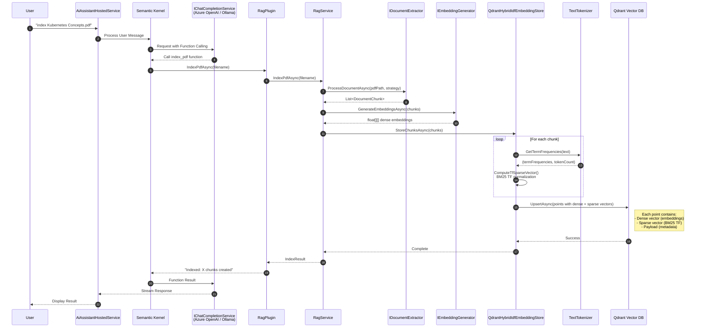
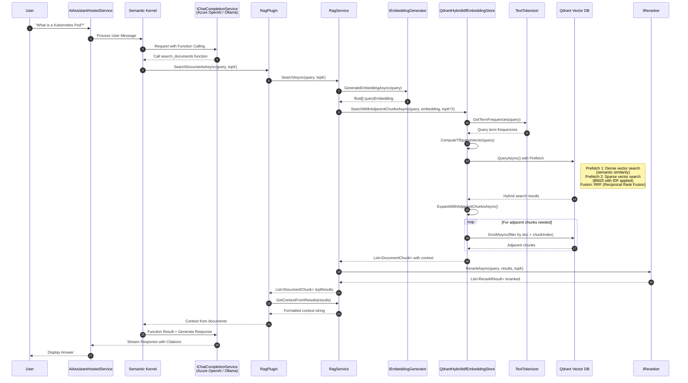
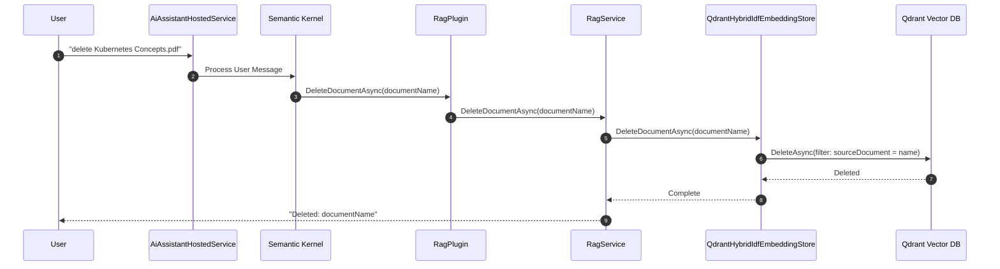

# LLM-RAG-Architecture

Production-grade Retrieval Augmented Generation (RAG) architecture demonstrating best practices for building AI-powered document search and Q&A systems.

## Overview

This repository provides a complete RAG solution featuring:

- **Hybrid Search**: Combines dense vector search with BM25 sparse vectors for improved retrieval accuracy
- **Reranking**: Cross-encoder models for result quality improvement
- **Multiple LLM Providers**: Support for Azure OpenAI, OpenAI, and local models (Ollama)
- **Vector Database**: Qdrant integration with multiple search strategies
- **PDF Processing**: Multiple extraction strategies for optimal document chunking
- **Interactive Chat**: Console-based assistant with Semantic Kernel function calling

Files to index for RAG must be in the `src/Ai.Rag.Demo/Data` folder. The current setup contains the Kubernetes documentation as an example.

## Architecture

```
┌─────────────────────────────────────────────────────────────────┐
│                        AI RAG Assistant                         │
│                     (Semantic Kernel + .NET)                    │
└─────────────────────────────────────────────────────────────────┘
                                │
        ┌───────────────────────┼───────────────────────┐
        ▼                       ▼                       ▼
┌───────────────┐      ┌───────────────┐      ┌───────────────┐
│  LLM Service  │      │   Embedding   │      │   Reranker    │
│ (Azure/Ollama)│      │    Service    │      │    Service    │
└───────────────┘      └───────────────┘      └───────────────┘
                              │                       │
                              ▼                       ▼
                       ┌─────────────┐         ┌─────────────┐
                       │   Qdrant    │         │Cross-Encoder│
                       │  (Hybrid)   │         │   (BAAI)    │
                       └─────────────┘         └─────────────┘
```

## Interaction Flows

### Application Startup

Initializes the Semantic Kernel with the RAG plugin, configures the LLM connection, and ensures the Qdrant vector collection exists with the required indexes for hybrid search (dense vectors for semantic similarity and sparse vectors for BM25 keyword matching).



### Document Indexing Flow

Processes a PDF document by extracting text, splitting it into chunks, generating dense embeddings, computing BM25 sparse vectors for each chunk, and storing all vectors with metadata in Qdrant. The LLM uses function calling to invoke the indexing operation.



### Question Answering Flow (Hybrid RAG Search)

Performs hybrid retrieval by combining dense vector semantic search with BM25 sparse vector keyword search, fusing results using Reciprocal Rank Fusion (RRF). Adjacent chunks are retrieved for context continuity, results are reranked using a cross-encoder, and the LLM generates a cited response.



### Document Deletion Flow

Removes all indexed chunks for a specified document from the Qdrant vector database by filtering on the source document name. This cleans up the index when documents are no longer needed.



## Project Structure

```
LLM-RAG-Architecture/
├── src/
│   ├── Ai.Rag.Demo/              # Main .NET RAG application
│   │   ├── DocumentExtraction/   # PDF processing & chunking
│   │   ├── EmbeddingGenerators/  # Embedding providers
│   │   ├── EmbeddingStores/      # Vector store implementations
│   │   ├── Rerankers/            # Reranking strategies
│   │   ├── Services/             # Core RAG orchestration
│   │   └── Plugins/              # Semantic Kernel plugins
│   ├── embedding/                # Python embedding service
│   │   ├── main.py               # FastAPI embedding server
│   │   └── Dockerfile
│   └── reranker/                 # Python reranker service
│       ├── main.py               # FastAPI reranker server
│       └── Dockerfile
├── tests/
│   └── Ai.Rag.Demo.Tests/        # Unit tests
├── docker-compose.yml            # Local development stack
└── README.md
```

## Quick Start

### Prerequisites

- [.NET 10 SDK](https://dotnet.microsoft.com/download)
- [Docker](https://www.docker.com/products/docker-desktop/) (for local services)
- Azure OpenAI resource OR [Ollama](https://ollama.ai/) for local LLM

### 1. Start Infrastructure Services

Start all services using Docker Compose:

```bash
docker-compose up -d
```

This starts:
| Service | Port | Description |
|---------|------|-------------|
| **Qdrant** | 6333 (REST), 6334 (gRPC) | Vector database |
| **Embedding** | 8001 | BAAI/bge-small-en-v1.5 embedding model |
| **Reranker** | 8000 | BAAI/bge-reranker-base cross-encoder |
| **Ollama** | 11434 | Local LLM service |
| **AI RAG Demo** | - | Interactive RAG application |

### 2. Configure the Application

Configuration is provided via environment variables in `docker-compose.yml`. The default configuration uses local services (Ollama + Docker services).

#### Option A: Local Development (Default)

The default `docker-compose.yml` configuration:

```yaml
environment:
  - Llm__Endpoint=http://ollama:11434/v1
  - Llm__ApiKey=ollama
  - Llm__ChatDeploymentName=llama3.2:3b
  - Embedding__Endpoint=http://embedding:8000/
  - Reranker__Endpoint=http://reranker:8000/
```

#### Option B: Azure OpenAI (Full Cloud)

Update the environment variables in `docker-compose.yml`:

```yaml
environment:
  - Llm__Endpoint=https://your-resource.openai.azure.com
  - Llm__ApiKey=your-api-key
  - Llm__ChatDeploymentName=gpt-4.1
  - Llm__Type=AzureOpenAi
  - Embedding__Endpoint=https://your-resource.openai.azure.com
  - Embedding__ApiKey=your-api-key
  - Embedding__DeploymentName=text-embedding-3-large
  - Embedding__Type=AzureOpenAi
  - Embedding__VectorSize=3072
  - Reranker__Endpoint=https://your-resource.openai.azure.com
  - Reranker__ApiKey=your-api-key
  - Reranker__DeploymentName=gpt-4.1-nano
  - Reranker__Type=AzureOpenAiLlm
```

### 3. Run the Application

To interact with the AI RAG Demo container:

```bash
docker attach ai-rag-demo
```

Or start fresh with an interactive session:

```bash
docker-compose run --rm ai-rag-demo
```

### 4. Use the Assistant

```
You: index Kubernetes Concepts.pdf
Assistant: Successfully indexed Kubernetes Concepts.pdf into 127 chunks

You: What is a Kubernetes Pod?
Assistant: [Provides answer with citations from indexed documents]

You: exit
```

## Services

### Embedding Service

A FastAPI service providing text embeddings using the **BAAI/bge-small-en-v1.5** model.

**Endpoints:**
- `GET /health` - Health check
- `POST /embed` - Generate embeddings

**Request:**
```json
{
  "texts": ["Hello world", "Another text"]
}
```

**Response:**
```json
{
  "embeddings": [[0.1, 0.2, ...], [0.3, 0.4, ...]],
  "dimensions": 384
}
```

### Reranker Service

A FastAPI service providing cross-encoder reranking using the **BAAI/bge-reranker-base** model.

**Endpoints:**
- `GET /health` - Health check
- `POST /rerank` - Rerank documents

**Request:**
```json
{
  "query": "What is Kubernetes?",
  "documents": ["Doc 1 text...", "Doc 2 text..."]
}
```

**Response:**
```json
{
  "scores": [0.95, 0.23]
}
```

### Running Services Individually

```bash
# Qdrant only
docker run -p 6333:6333 -p 6334:6334 qdrant/qdrant

# Build and run embedding service
docker build -t embedding ./src/embedding
docker run -p 8001:8000 embedding

# Build and run reranker service
docker build -t reranker ./src/reranker
docker run -p 8000:8000 reranker

# Build and run AI RAG Demo
docker build -t ai-rag-demo ./src/Ai.Rag.Demo
docker run -it ai-rag-demo
```

## Configuration Reference

### LLM Settings

| Setting | Description | Values |
|---------|-------------|--------|
| `Endpoint` | LLM API endpoint | URL |
| `ApiKey` | API key | String |
| `ChatDeploymentName` | Model name | e.g., `gpt-4.1`, `llama3.2:3b` |
| `Type` | Provider type | `AzureOpenAi`, `OpenAi` |

### Embedding Settings

| Setting | Description | Values |
|---------|-------------|--------|
| `Endpoint` | Embedding API endpoint | URL |
| `ApiKey` | API key (if required) | String |
| `DeploymentName` | Model name | e.g., `text-embedding-3-large` |
| `Type` | Provider type | `AzureOpenAi`, `Http` |
| `MaxChunkTokens` | Max tokens per chunk | Integer (default: 400) |
| `ChunkOverlapTokens` | Overlap between chunks | Integer (default: 50) |
| `VectorSize` | Embedding dimensions | 384, 1536, 3072 |
| `DenseVectorWeight` | Hybrid search weight | 0.0-1.0 (default: 0.7) |
| `StoreType` | Vector store | `FileSystem`, `Qdrant`, `QdrantHybrid`, `QdrantHybridIdf` |

### Reranker Settings

| Setting | Description | Values |
|---------|-------------|--------|
| `Endpoint` | Reranker API endpoint | URL |
| `ApiKey` | API key (if required) | String |
| `DeploymentName` | Model name (LLM reranker) | String |
| `Type` | Reranker type | `CrossEncoder`, `AzureOpenAiLlm` |

## RAG Pipeline

1. **Document Ingestion**
   - PDF extraction with multiple strategies (bookmark, format-based, simple)
   - Text chunking with configurable size and overlap
   - Token counting using ML.Tokenizers

2. **Embedding & Indexing**
   - Dense vector generation (Azure OpenAI or local model)
   - BM25 sparse vector generation for hybrid search
   - Storage in Qdrant with IDF weighting

3. **Retrieval**
   - Hybrid search combining dense and sparse vectors
   - Adjacent chunk retrieval for better context
   - Configurable top-K results

4. **Reranking**
   - Cross-encoder scoring for relevance
   - LLM-based reranking option
   - Final top-K selection

5. **Response Generation**
   - Semantic Kernel with automatic function calling
   - Context injection from retrieved documents
   - Source citations in responses

## Development

### Running Tests

```bash
cd tests/Ai.Rag.Demo.Tests
dotnet test
```

### Building Docker Images

```bash
# Build all services
docker-compose build

# Push to registry (optional)
docker-compose push
```

## Technologies

| Component | Technology |
|-----------|------------|
| **Application** | .NET 10, C# 14 |
| **AI Orchestration** | Microsoft Semantic Kernel |
| **Vector Database** | Qdrant |
| **Embeddings** | Azure OpenAI / BAAI/bge-small-en-v1.5 |
| **Reranking** | BAAI/bge-reranker-base / Azure OpenAI |
| **PDF Processing** | PdfPig |
| **Tokenization** | Microsoft.ML.Tokenizers |
| **API Framework** | FastAPI (Python services) |

## License

MIT License - See [LICENSE](LICENSE) for details.
